# Домашнее задание к занятию "`Оркестрация группой Docker контейнеров на примере Docker Compose`" - `Милованов Константин`
[Домашнее задание](https://github.com/netology-code/virtd-homeworks/blob/shvirtd-1/05-virt-03-docker-intro/README.md)


### Задание 1

 1. Установите docker и docker compose plugin на свою linux рабочую станцию или ВМ.
 2. Если dockerhub недоступен создайте файл /etc/docker/daemon.json с содержимым: {"registry-mirrors": ["https://mirror.gcr.io", "https://daocloud.io", "https://c.163.com/", "https://registry.docker-cn.com"]}
 3. Зарегистрируйтесь и создайте публичный репозиторий с именем "custom-nginx" на https://hub.docker.com (ТОЛЬКО ЕСЛИ У ВАС ЕСТЬ ДОСТУП);
 4. скачайте образ nginx:1.29.0;
 5. Создайте Dockerfile и реализуйте в нем замену дефолтной индекс-страницы(/usr/share/nginx/html/index.html), на файл index.html с содержимым:

```
<html>
<head>
Hey, Netology
</head>
<body>
<h1>I will be DevOps Engineer!</h1>
</body>
</html>
```

Соберите и отправьте созданный образ в свой dockerhub-репозитории c tag .0.0 (ТОЛЬКО ЕСЛИ ЕСТЬ ДОСТУП).
Предоставьте ответ в виде ссылки на https://hub.docker.com/username_repo>/custom-nginx/general .


### Решение:

Готовый образ по ссылке: https://hub.docker.com/r/mxkostix/custom-nginx/tags

Подробности выполнения:

Dockerfile:
```
FROM nginx:1.29.0

COPY index.html /usr/share/nginx/html/index.html
```

Далее:
```
docker build -t mxkostix/custom-nginx:1.0.0 .
docker run -d -p 80:80 --name custom-nginx mxkostix/custom-nginx:1.0.0
docker push mxkostix/custom-nginx:1.0.0
```


---

### Задание 2


1. Запустите ваш образ custom-nginx:1.0.0 командой docker run в соответвии с требованиями:

* имя контейнера "ФИО-custom-nginx-t2"
* контейнер работает в фоне
* контейнер опубликован на порту хост системы 127.0.0.1:8080

2. Не удаляя, переименуйте контейнер в "custom-nginx-t2"
3. Выполните команду date +"%d-%m-%Y %T.%N %Z" ; sleep 0.150 ; docker ps ; ss -tlpn | grep 127.0.0.1:8080  ; docker logs custom-nginx-t2 -n1 ; docker exec -it custom-nginx-t2 base64 /usr/share/nginx/html/index.html
4. Убедитесь с помощью curl или веб браузера, что индекс-страница доступна.

В качестве ответа приложите скриншоты консоли, где видно все введенные команды и их вывод.


### Решение:

Скрин консоли:

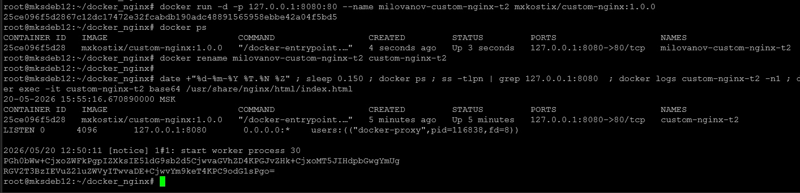


### Задание 3


1. Воспользуйтесь docker help или google, чтобы узнать как подключиться к стандартному потоку ввода/вывода/ошибок контейнера "custom-nginx-t2".
2. Подключитесь к контейнеру и нажмите комбинацию Ctrl-C.
3. Выполните docker ps -a и объясните своими словами почему контейнер остановился.
4. Перезапустите контейнер
5. Зайдите в интерактивный терминал контейнера "custom-nginx-t2" с оболочкой bash.
6. Установите любимый текстовый редактор(vim, nano итд) с помощью apt-get.
7. Отредактируйте файл "/etc/nginx/conf.d/default.conf", заменив порт "listen 80" на "listen 81".
8. Запомните(!) и выполните команду nginx -s reload, а затем внутри контейнера curl http://127.0.0.1:80 ; curl http://127.0.0.1:81.
9. Выйдите из контейнера, набрав в консоли exit или Ctrl-D.
10. Проверьте вывод команд: ss -tlpn | grep 127.0.0.1:8080 , docker port custom-nginx-t2, curl http://127.0.0.1:8080. Кратко объясните суть возникшей проблемы.
11. *Это дополнительное, необязательное задание. Попробуйте самостоятельно исправить конфигурацию контейнера, используя доступные источники в интернете. Не изменяйте конфигурацию nginx и не удаляйте контейнер. Останавливать контейнер можно. пример источника https://www.baeldung.com/linux/assign-port-docker-container
12. Удалите запущенный контейнер "custom-nginx-t2", не останавливая его.(воспользуйтесь --help или google)

В качестве ответа приложите скриншоты консоли, где видно все введенные команды и их вывод.


### Решение:

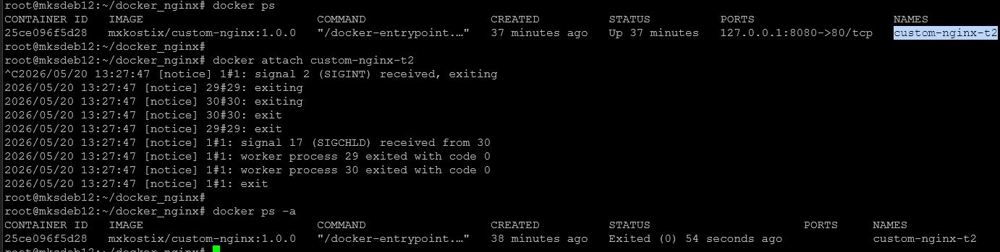

Ctrl-C: контейнер остановился, потому что после нажатия Ctrl-C Docker проксирует ввод внутрь контейнера основному процессу. Процесс завершается, контейнер останавливается. В Docker контейнер живёт, пока жив PID 1. Если завершился процесс, запущенный как PID 1 — контейнер считается завершённым.

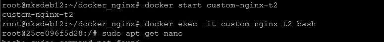
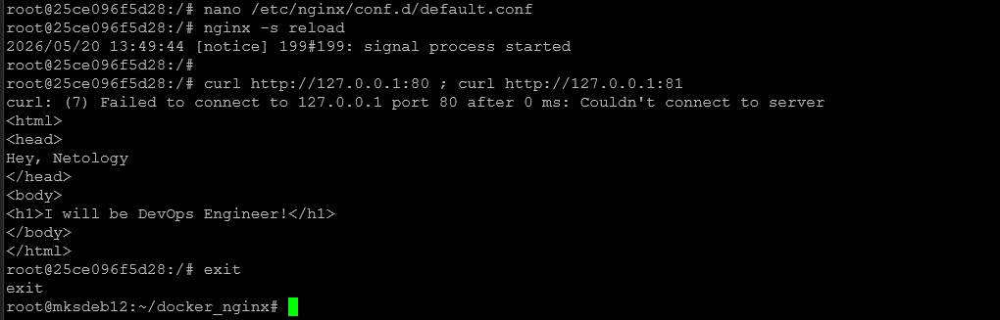
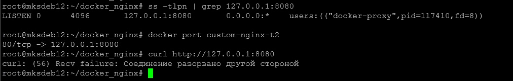

Мы ранее пробросили порт 8080 на порт 80 контейнера. Теперь мы сказали nginx "слушай на порту 81". Поэтому при попытке на хосту подключиться к порту 8080 и через него к контейнеру на порт 81 контейнер сбрасывает соединение, так как он больше не слушает порт 80.

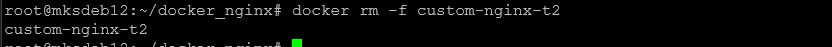


### Задание 4

* Запустите первый контейнер из образа centos c любым тегом в фоновом режиме, подключив папку текущий рабочий каталог $(pwd) на хостовой машине в /data контейнера, используя ключ -v.
* Запустите второй контейнер из образа debian в фоновом режиме, подключив текущий рабочий каталог $(pwd) в /data контейнера.
* Подключитесь к первому контейнеру с помощью docker exec и создайте текстовый файл любого содержания в /data.
* Добавьте ещё один файл в текущий каталог $(pwd) на хостовой машине.
* Подключитесь во второй контейнер и отобразите листинг и содержание файлов в /data контейнера.

В качестве ответа приложите скриншоты консоли, где видно все введенные команды и их вывод.

### Решение:

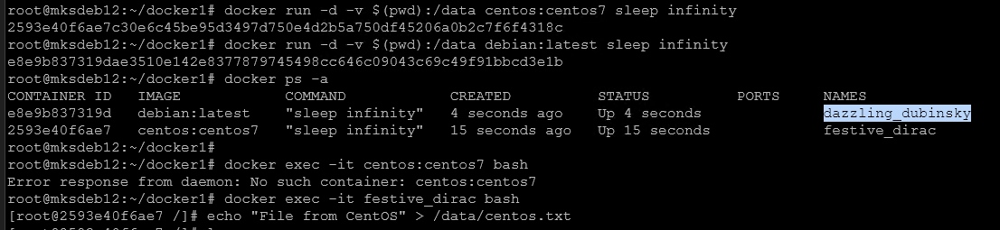
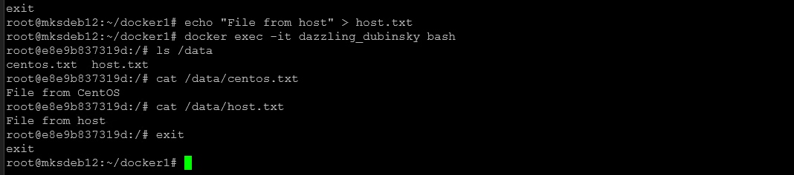


### Задание 5


1. Создайте отдельную директорию(например /tmp/netology/docker/task5) и 2 файла внутри него. "compose.yaml" с содержимым:

```
version: "3"
services:
  portainer:
    network_mode: host
    image: portainer/portainer-ce:latest
    volumes:
      - /var/run/docker.sock:/var/run/docker.sock
```

"docker-compose.yaml" с содержимым:

```
version: "3"
services:
  registry:
    image: registry:2

    ports:
    - "5000:5000"
```

И выполните команду "docker compose up -d". Какой из файлов был запущен и почему? (подсказка: https://docs.docker.com/compose/compose-application-model/#the-compose-file )

2. Отредактируйте файл compose.yaml так, чтобы были запущенны оба файла. (подсказка: https://docs.docker.com/compose/compose-file/14-include/)

3. Выполните в консоли вашей хостовой ОС необходимые команды чтобы залить образ custom-nginx как custom-nginx:latest в запущенное вами, локальное registry. Дополнительная документация: https://distribution.github.io/distribution/about/deploying/

4. Откройте страницу "https://127.0.0.1:9000" и произведите начальную настройку portainer.(логин и пароль адмнистратора)

5. Откройте страницу "http://127.0.0.1:9000/#!/home", выберите ваше local окружение. Перейдите на вкладку "stacks" и в "web editor" задеплойте следующий компоуз:

version: '3'

services:
  nginx:
    image: 127.0.0.1:5000/custom-nginx
    ports:
      - "9090:80"

6. Перейдите на страницу "http://127.0.0.1:9000/#!/2/docker/containers", выберите контейнер с nginx и нажмите на кнопку "inspect". В представлении <> Tree разверните поле "Config" и сделайте скриншот от поля "AppArmorProfile" до "Driver".

7. Удалите любой из манифестов компоуза(например compose.yaml). Выполните команду "docker compose up -d". Прочитайте warning, объясните суть предупреждения и выполните предложенное действие. Погасите compose-проект ОДНОЙ(обязательно!!) командой.

В качестве ответа приложите скриншоты консоли, где видно все введенные команды и их вывод, файл compose.yaml , скриншот portainer c задеплоенным компоузом.

### Решение:

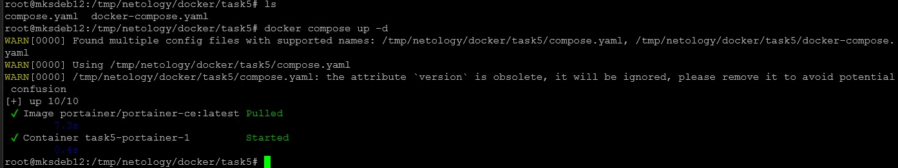

Был запущен только compose.yaml, потому что согласно официальной документации Docker Compose предпочтение отдается compose.yaml или compose.yml: The default path for a Compose file is compose.yaml (preferred) or compose.yml that is placed in the working directory. Compose also supports docker-compose.yaml and docker-compose.yml for backwards compatibility of earlier versions. If both files exist, Compose prefers the canonical compose.yaml.

Чтобы запустились оба файла, добавляем в compose.yaml строку:
```
include:
  - docker-compose.yaml
```

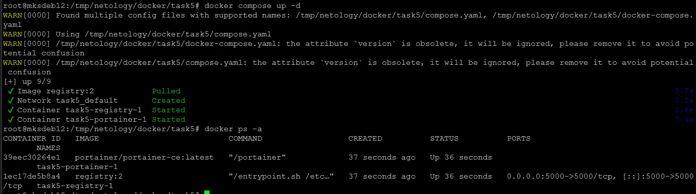

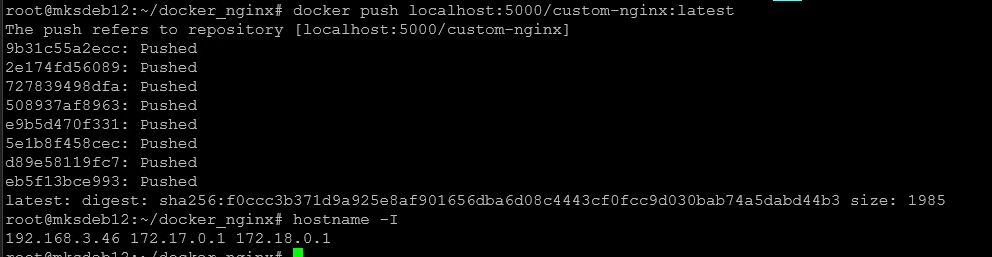

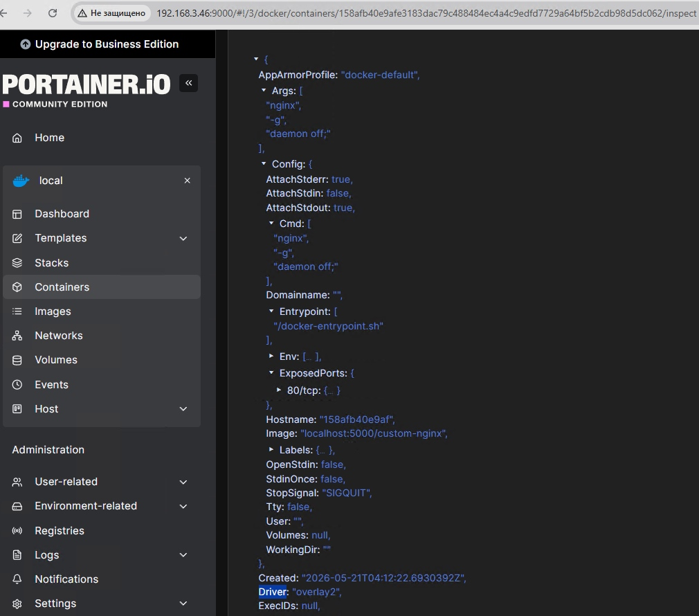

После удаления compose.yaml:

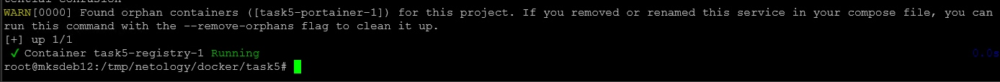

Docker Compose обнаружил сиротский контейнер task5-portainer-1, который был создан ранее из файла compose.yaml, но сейчас файл удалён. Контейнер больше не управляется текущей конфигурацией.

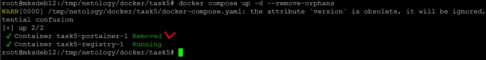